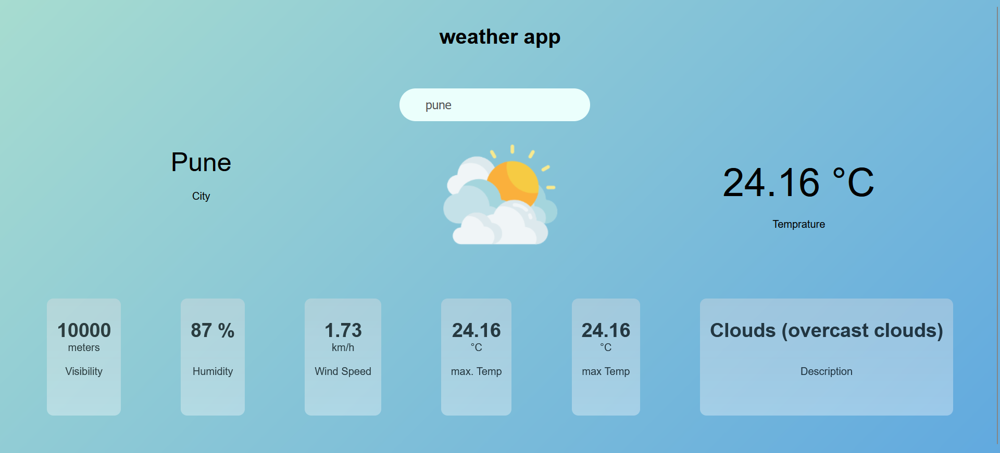

# Weather App

**Description:**
Creating a weather app using React involves several steps. In this example, I'll guide you through the process of creating a simple weather app that fetches weather data from a free weather API (OpenWeatherMap) and displays it to the user. Please note that you'll need to sign up for a free API key from OpenWeatherMap to use their services.

Here's a high-level overview of the steps we'll be following:
<ul>
<li>Set up a new React project. </li>
<li>Create components for your weather app.</li>
<li>Fetch weather data from the API. </li>
<li>Display the weather information to the user. </li>

</ul>

